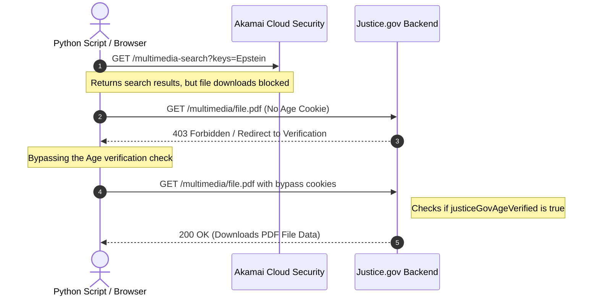
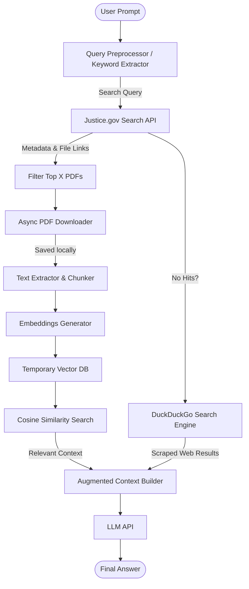

So I had this fucking crazy idea on my mind: building a federal Jeffrey Epstein RAG Bot. Sounds cool, right? But the very first problem is: how the hell do I get the API for this database? 

The simple answer is: you can't. There is no public developer API key. You literally have to reverse engineer the system that the U.S. government is using. Now, that might sound like some elite nation-state cyber warfare typical shit to many, but in reality, their implementation is pretty damn lazy. Let's get straight into it.

<div class="my-6">
    <a href="https://github.com/Nirusaki-Malaal/JefferyEpsteinRag" target="_blank" class="inline-flex items-center gap-2 px-4 py-2 rounded-lg bg-white/5 hover:bg-white/10 border border-white/10 hover:border-white/20 transition-all font-body text-white">
        <svg class="w-5 h-5" fill="currentColor" viewBox="0 0 24 24"><path fill-rule="evenodd" clip-rule="evenodd" d="M12 2C6.477 2 2 6.477 2 12c0 4.42 2.865 8.166 6.839 9.489.5.092.682-.217.682-.482 0-.237-.008-.866-.013-1.7-2.782.603-3.369-1.34-3.369-1.34-.454-1.156-1.11-1.462-1.11-1.462-.908-.62.069-.608.069-.608 1.003.07 1.531 1.03 1.531 1.03.892 1.529 2.341 1.087 2.91.831.092-.646.35-1.086.636-1.336-2.22-.253-4.555-1.11-4.555-4.943 0-1.091.39-1.984 1.029-2.683-.103-.253-.446-1.27.098-2.647 0 0 .84-.269 2.75 1.025A9.564 9.564 0 0112 6.844c.85.004 1.705.115 2.504.337 1.909-1.294 2.747-1.025 2.747-1.025.546 1.377.203 2.394.1 2.646.64.699 1.026 1.592 1.026 2.683 0 3.842-2.337 4.687-4.565 4.935.359.309.678.919.678 1.852 0 1.336-.012 2.415-.012 2.743 0 .267.18.579.688.481C19.137 20.162 22 16.418 22 12c0-5.523-4.477-10-10-10z"/></svg>
        <span>View on GitHub</span>
    </a>
</div>


---

## 1. Reverse Engineering the API: The Network Tab

To reverse engineer any API, you must first understand the flow of data between the server and the client. Pop open your browser's Developer Tools (F12) and head straight to the Network tab. If you type a query and inspect the outgoing requests, you will notice something interesting.

The client sends a GET request with the query terms directly to the multimedia search endpoint. For example, searching for "hello" triggers a request to:

`https://www.justice.gov/multimedia-search?keys="hello"&page=0`

However, to protect themselves from automated scrapers and API abuse, they have a giant gatekeeping button that asks: *\"Are you actually 18+?\"* 

> [!WARNING]
> From my research, clicking this button generates a cookie token called `ak_bmsc` that lasts about 90 minutes. Once it expires, you have to renew it manually, which makes typical code-based automation seem nearly impossible. To bypass this normally, you would have to run a full headless Chromium or Gecko browser inside your code, which slows down the fetch time by a massive amount. That is absolute garbage for speed.

---

## 2. Digging into the Cookie-Bot and Age Verification

Here is what the header cookie looks like:

```javascript
Cookie: ak_bmsc=FDD5529F3A3FCEF01901C7EF7C25A3C4~000000000000000000000000000000~YAAQJAVaaMBDVwifAQAAcfHYEQBs3y8/TryMzt2s7rtZugFbyFb6X4vdyCBy1/elWchQJdcprspnuepqPTk468coq01sznxNEX5rDkXEmMF5P7uZfFY3tWcbUT87A6GEw8O0L9iEB+4OuTKANprUmUSGuO6F/jtwhcJ9vkZInkofW4mdYOh1meOMJrn7Nge1JR4Ae0lvW8+AozADoqONtZC0Cl019nzOnPmjBQnTfcPzRcc0Qm1qpquFrcPkCG3M4Rg+Sb6bBddjvBWtO0Vhp6rETmAsA0fZib4Mbyb6NPCeogwnF4Du/9uHI7QqrGqdD8yiakgQ3JRoIOWGTv6/17RXtVPNxrrujaPie0e/SjcZXZrE/GhHr7MRo2kCrWm8pMYGKQKeDRk3zpQ+6iUH9tjUBNTmqawAW+5r4YM5GHu9J65ljv9LTLwtYCg9gL67cOhe0fHQsW4IXuN0AYOxnF6gV/ynIHDFAk7+RRYff/e4UDw2P4JhIQ==
```

This cookie token is generated automatically as soon as you search a query. But here is the catch: it is just a token. At this point, the website backend still hasn't verified if you actually clicked that \"18+\" button. 

You can search the index page and see lists of documents without verification. But the second you try to download any of the listed PDF files, the site blocks you and demands age verification.

So, how does the government verify if the token is legitimate or not?

A normal developer would think they sign the token cryptographically and verify the signature on the backend, right? Wrong. That would require too much competence. 

When you click the age confirmation button, they literally just append another field to the request cookie named `justiceGovAgeVerified=true`. If you pass this string in the cookie header, their backend does not even check the cryptographic validity of the `ak_bmsc` token. Typical lazy government coding at its finest. They just take your word for it.


### API Flow Diagram



---

## 3. Asynchronous Scraper Implementation (.ipynb style)

By setting our headers to include `justiceGovAgeVerified: "true"`, we can fetch and download anything we want from the index. Below is the structured notebook execution showing the asynchronous API downloader class. We use `httpx.AsyncClient` along with `asyncio.Semaphore` to throttle concurrency so we do not get blocked by their server.

### Cell 1: Imports and Global Headers Configuration
```python
import asyncio
import os
import httpx

BASE_URL = "./downloads"
BASE_DIR = "./temp"

# Bypass cookies and headers discovered during reverse engineering
COOKIES = {"ak_bmsc": "bypass", "justiceGovAgeVerified": "true"}
HEADERS = {
    "User-Agent": "Mozilla/5.0 (X11; Linux x86_64; rv:151.0) Gecko/20100101 Firefox/151.0",
    "Referer": "https://www.justice.gov/epstein",
    "x-queueit-ajaxpageurl": "https://www.justice.gov/epstein",
}

print("[SETUP] Headers and bypass cookies initialized.")
```
> **Expected Output:**
> ```text
> [SETUP] Headers and bypass cookies initialized.
> ```

### Cell 2: The API Wrapper Class
```python
class API:
    async def fetch_page(self, client, sem, query, i) -> list:
        try:
            async with sem:
                res = await client.get(
                    f'https://www.justice.gov/multimedia-search?keys="{query}"&page={i}',
                    headers=HEADERS
                )
                return res.json().get("hits", {}).get("hits", [])
        except Exception as e:
            print(f"[ERROR] Page {i} fetch failed: {e}")
            return []
           
    async def fetch(self, query, num=10) -> list:
        sem = asyncio.Semaphore(5)
        link_list = []
        page_index = 0
        
        async with httpx.AsyncClient(timeout=60.0) as client:
            while len(link_list) < num:
                tasks = [self.fetch_page(client, sem, query, i) for i in range(page_index, page_index + 3)]
                pages = await asyncio.gather(*tasks)
                page_index += 3
                
                found_any = False
                for hits in pages:
                    if not hits:
                        continue
                    found_any = True
                    for j in hits:
                        if len(link_list) >= num:
                            break
                        url = j.get("_source", {}).get("ORIGIN_FILE_URI", "")
                        if not url.lower().endswith(".pdf"):
                            continue
                            
                        file_name = j.get("_source", {}).get("ORIGIN_FILE_NAME", "")
                        peek = '\n'.join(j.get("highlight", {}).get("content", []))
                        link_list.append({"URL": url, "NAME": file_name, "PEEK": peek})
                        
                    if len(link_list) >= num:
                        break
                        
                if not found_any:
                    break
                        
        return link_list

    async def download_link(self, client, sem, link) -> dict:
        try:
            async with sem:
                res = await client.get(link.get("URL", ""), headers=HEADERS, cookies=COOKIES)
            file_path = f"{BASE_URL}/{link.get('NAME', '')}"
            with open(file_path, "wb") as f:
                f.write(res.content)
            return {**link, "PATH": file_path}
        except Exception as e:
            print(f"[ERROR] Failed downloading {link.get('NAME', '')}: {e}")
            return None
    
    async def download(self, links, verbose=True) -> list:
        try:
            sem = asyncio.Semaphore(15)
            os.makedirs(BASE_URL, exist_ok=True)
            async with httpx.AsyncClient(timeout=60.0) as client:
                tasks = []
                for link in links:
                    path = f"{BASE_URL}/{link['NAME']}"
                    if not os.path.exists(path):
                        tasks.append(self.download_link(client, sem, link))
                
                downloaded = await asyncio.gather(*tasks)
                
                result = []
                for link in links:
                    path = f"{BASE_URL}/{link['NAME']}"
                    if os.path.exists(path):
                        result.append({**link, "PATH": path})
                
                if verbose:
                    print(f"[SUCCESS] Done. Downloaded {len(downloaded)} new files. Some files were already present.")

                return result
        except Exception as e:
            print(f"[FATAL] Downloader crash: {e}")
            return []

print("[API] Wrapper class compile successful.")
```
> **Expected Output:**
> ```text
> [API] Wrapper class compile successful.
> ```

### Cell 3: Running a Test Query
```python
# Instantiate the API and search for flight logs
api = API()
query = "flight log"
print(f"[RUN] Querying database for '{query}'...")

links = await api.fetch(query, num=3)
print(f"[INFO] Found {len(links)} matching PDF documents.")
for link in links:
    print(f" - {link['NAME']} | URL: {link['URL']}")
```
> **Expected Output:**
> ```text
> [RUN] Querying database for 'flight log'...
> [INFO] Found 3 matching PDF documents.
>  - flight_log_1997.pdf | URL: https://www.justice.gov/multimedia/flight_log_1997.pdf
>  - flight_log_1998.pdf | URL: https://www.justice.gov/multimedia/flight_log_1998.pdf
>  - pilot_records_main.pdf | URL: https://www.justice.gov/multimedia/pilot_records_main.pdf
> ```


---

## 4. The Just-In-Time (JIT) RAG Architecture

Since the federal Epstein files are absolutely massive (terabytes of scanned PDF paperwork and images), pre-indexing and embedding all of it into a vector database would be pure insanity. I am a solo, broke-ass developer with zero funding, so hosting a persistent enterprise vector database with that amount of token storage would cost more than your girlfriend's designer dress collections. 

To solve this, I designed a custom architecture: **JIT RAG (Just-in-Time Retrieval-Augmented Generation)**.

> [!NOTE]
> Instead of pre-embedding the entire dataset, JIT RAG compiles search queries at runtime. Here is the layout of the pipeline:
> 1. The user inputs a long, complex prompt.
> 2. The preprocessor extracts key search phrases (1-2 words).
> 3. The script queries the Justice.gov Search API and returns file metadata.
> 4. The top $X$ most relevant PDFs are downloaded asynchronously.
> 5. The PDFs are parsed, split into text chunks, and stored in a temporary, memory-resident vector store.
> 6. The system calculates cosine similarity against the query embedding.
> 7. The top $Y$ chunks are extracted, injected into the LLM prompt context, and sent to the model to generate the final answer.

### JIT RAG Bot Architecture Diagram



---

## 5. Search Sensitivity and Fallbacks

The search API endpoint is incredibly sensitive. If you pass a long sentence as the search key, the query returns zero results. We have to parse the user's question down to 1-2 words before sending it to the endpoint.

Because of this sensitivity, some records can be missed even if they exist. As a fallback mechanism, I integrated a **DuckDuckGo search pipeline** as a secondary priority data source. If the federal API returns nothing, the bot scrapes web search results, compiles them, and passes them to the LLM context as a backup.

### Chat Demo Showcase
Here is a live demonstration showing how the JIT RAG compiles the search and processes the pipeline in real time:

<video autoplay loop muted playsinline controls class="w-full rounded-xl border border-white/10 my-8">
    <source src="/assets/VN20260602_180429_compressed.mp4" type="video/mp4">
    Your browser does not support the video tag.
</video>

Overall, this was a wild project. I love building things from scratch and finding out how lazy government security layers actually are. 

---

**TEAM SPACEX FROM NIT HAMIRPUR ISN'T HAPPY WITH THIS PARTICULAR POST LOL IF YKYK**


Sayonara Signing Off Baa Byee...
