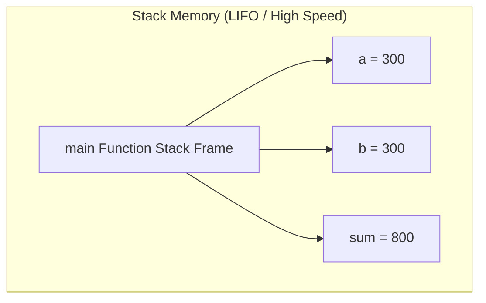
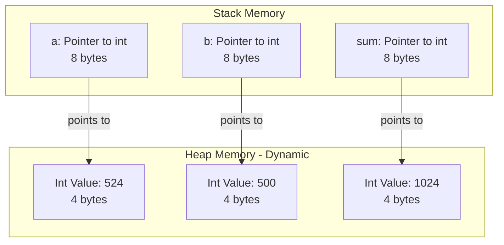
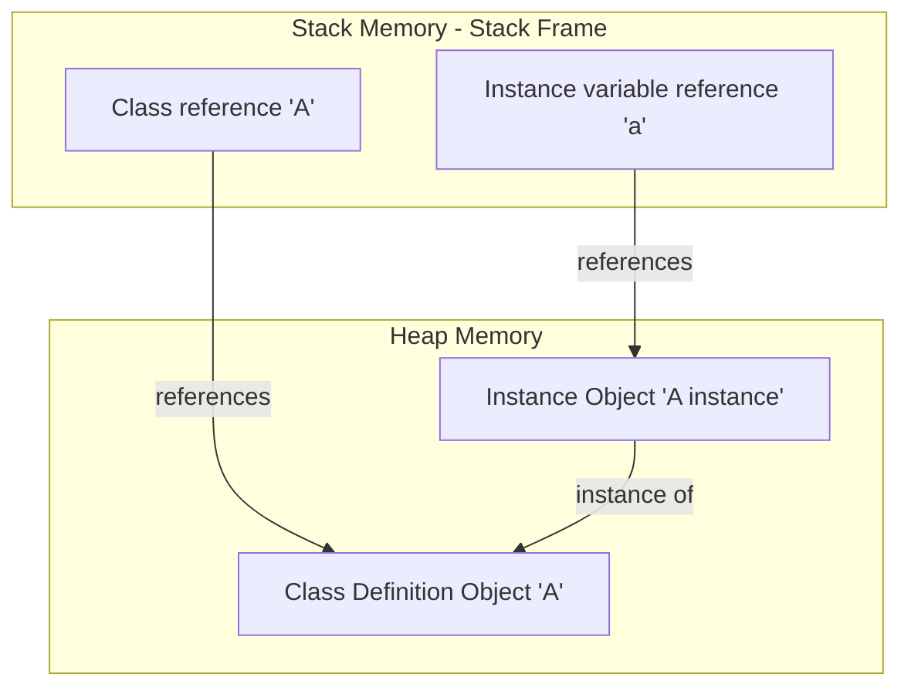

I am thinking of exploring some of the python internals and how it is engineered to better understand its working.

So you might have heard about the concept of stack and heap in terms of the operating system.


---

# Stack

We will first talk about C, then come to the Python reference.

The stack is a data structure which is used to hold variables like local variables and constants. The variables are automatically allocated and then deallocated by the compiler.

### Diagram: Stack Memory Allocation



For example:

### Cell 1: Stack Allocation in C
```c
#include <stdio.h>

int main()
{
  int a = 300;
  int b = 300;
  int sum = 800;
  return sum;
}
```
> **Expected Output:**
> ```text
> 800
> ```

Here is a simple C program for you to understand the stack and heap. When the program starts, the system stores these variables one by one in the stack and when they are no longer in use, it pops them out as well.

The stack is incredibly fast since memory allocation is just moving a pointer, nothing more. No complex instructions, just pointer arithmetic.

The stack has a fixed size; using too much stack memory may give you a stack overflow.

## A stack frame is created whenever a function is called

When you start the C executable, it first loads the executable into RAM. When `main()` is called, it creates a stack frame which pushes all the variables and constants into it. These things cannot be changed during the runtime, unlike the heap.


---

# Heap: Dynamic Memory Allocation

Unlike the stack, the heap allows dynamic memory allocations.

The heap is another memory space. It is different from the stack; it is slow, and may be defined as a region of memory that is not automatically managed. We need to use `free()` at the end of the program, or it will cause a memory leak.

### Diagram: Stack Pointers referencing Heap Objects



For example:

### Cell 2: Heap Allocation in C
```c
#include <stdio.h>
#include <stdlib.h>  /* Required for malloc/free */

int main(void)
{
  int *a;
  int *b;
  int *sum;
  
  a = (int*)malloc(sizeof(int));
  b = (int*)malloc(sizeof(int));
  sum = (int*)malloc(sizeof(int));
  
  if (a == NULL || b == NULL || sum == NULL) {
    printf("Memory allocation failed\n");
    return 1;
  }
  
  *a = 524;
  *b = 500;
  *sum = *a + *b;
  
  printf("My sum: %d\n", *sum);
  
  free(a);
  free(b);
  free(sum);
  
  return 0;
}
```
> **Expected Output:**
> ```text
> My sum: 1024
> ```

What this does is allocate 4 bytes of memory at a location in the heap. It then sends back the reference of the location to the system and stores it in `a`. The `int` pointer takes 8 bytes of storage in the stack, by the way.

We use `&` as the reference operator and `*` as the de-reference operator. `malloc()` stands for memory allocate, and at the end of the program we deallocate the memory back again and give it back to the operating system.

If we forget to use `free()`, this will cause a memory leak (unusable memory). If, let's take for example, you have remotely hosted a function with a memory leak, a DDoS attack can crash the system since running it each time increases the memory usage.


---

# Python

We know that we can change anything in Python at runtime. Everything in Python is hence an object, and it lives on the heap. However, the reference to that pointer lives on the stack.

### Diagram: Python References and Objects



For example:

### Cell 3: Python References and Objects
```python
class A:
  pass

a = A()
```

Here, `A` is a blueprint of the object; it lives on the heap and the reference of `A` lives on the stack.

`a` is the actual object; it lives on the heap but again, the reference lives on the stack.


---


byee.. signing out
