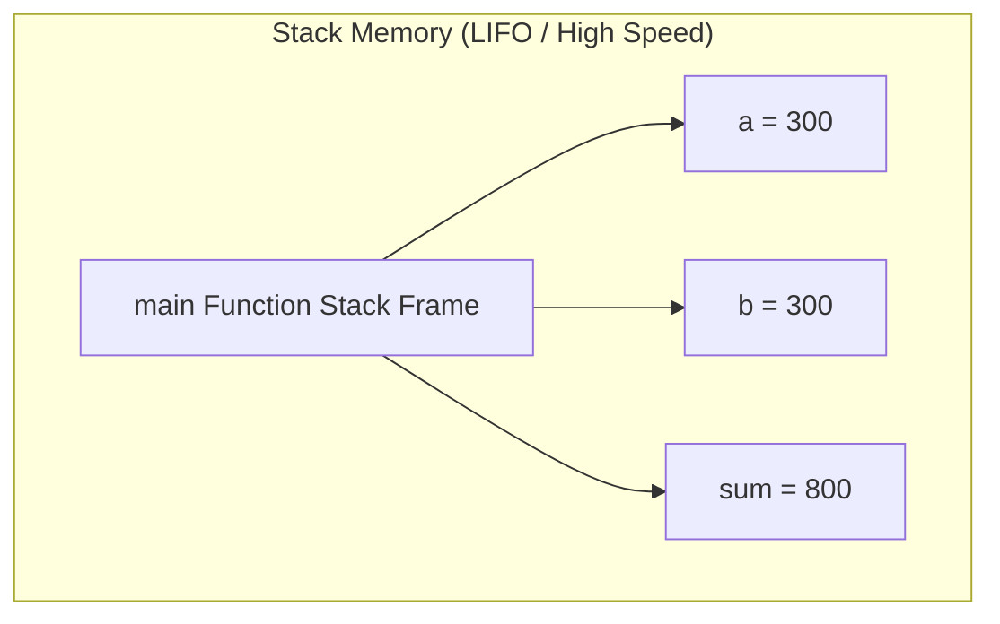
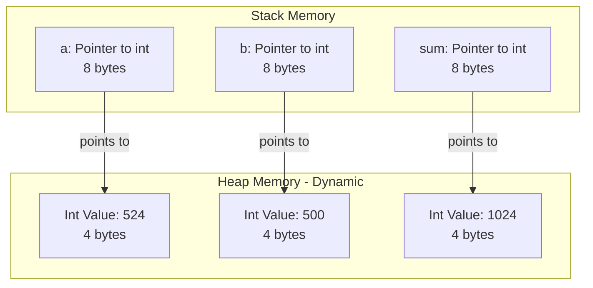
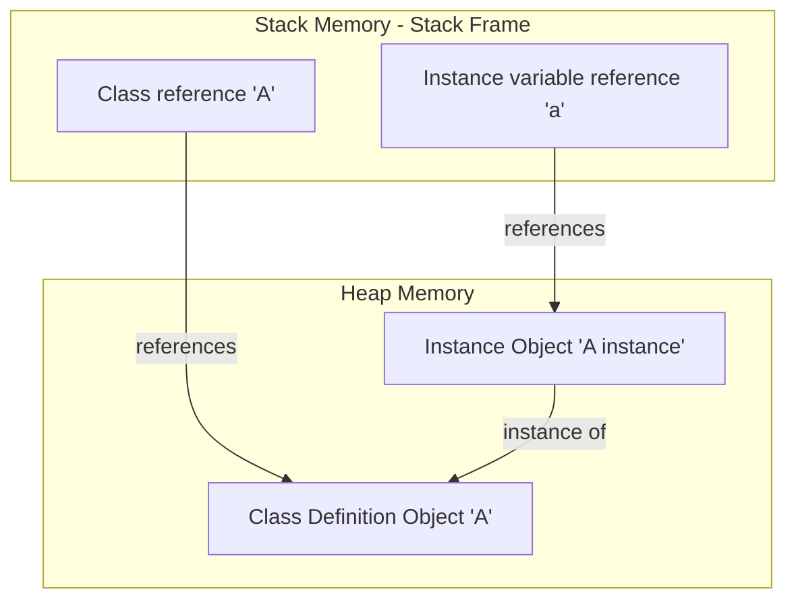

I have been thinking a lot about exploring Python internals lately. If you want to write highly optimized code, you have to stop treating the interpreter as a magic black box and actually understand how it is engineered. 

You have probably heard about the stack and the heap in terms of operating system memory. But how do they actually interact when you run your code? Let's explore this using C as a reference point first, and then dive deep into how Python handles the exact same concepts.


---

## 1. The Stack: Fast and Static (C Style)

The stack is a contiguous region of memory managed strictly by the CPU. It stores temporary variables created by active functions. 

The stack is a LIFO (Last In, First Out) structure. Memory allocation is incredibly fast because it only requires moving the stack pointer. No complex memory searches, no fragmentation - just basic pointer arithmetic. However, the stack has a fixed size. If you allocate too much data on it (like a massive array or an infinite recursive function), the system will crash with a stack overflow.

Every time a function is called, a new **stack frame** is pushed onto the stack. This frame stores the function's local variables and constants. Once the function returns, its stack frame is popped off, and that memory is instantly reclaimed by the operating system.

### Diagram: Stack Memory Allocation



Here is a simple C program demonstrating stack allocation:

### Cell 1: Stack Allocation in C
```c
#include <stdio.h>

int main()
{
    int a = 300;
    int b = 300;
    int sum = a + b + 200; // sum = 800
    return sum;
}
```
> **Expected Output (Exit Status returned to OS):**
> ```text
> 800
> ```

All three integers (`a`, `b`, and `sum`) are stored directly inside `main()`'s stack frame. When the program exits, the frame is cleared, and that memory disappears.


---

## 2. The Heap: Dynamic and Unmanaged

Unlike the stack, the heap is a large, unmanaged pool of memory used for dynamic allocations. The size of the heap is not fixed at compile time; you can request block allocations of arbitrary sizes during runtime. 

Because the heap is unmanaged, the programmer is fully responsible for it. In C, if you allocate memory on the heap using `malloc()`, you **must** release it using `free()`. If you forget, the memory stays allocated even after the pointer is destroyed, leading to a memory leak. 

> [!CAUTION]
> If you host a service with a memory leak, a malicious user can trigger a simple DDoS attack. By making repeated requests that leak just a few kilobytes of RAM, they can eventually deplete your system's memory and crash the entire server.

### Diagram: Stack Pointers referencing Heap Objects



Here is how dynamic heap allocation looks in C:

### Cell 2: Heap Allocation in C
```c
#include <stdio.h>
#include <stdlib.h>

int main(void)
{
    int *a;
    int *b;
    int *sum;

    // Allocate 4 bytes on the heap for each integer
    a = (int*)malloc(sizeof(int));
    b = (int*)malloc(sizeof(int));
    sum = (int*)malloc(sizeof(int));

    if (a == NULL || b == NULL || sum == NULL) {
        printf("Memory allocation failed\n");
        return 1;
    }

    *a = 524;
    *b = 500;
    *sum = *a + *b;

    printf("My sum: %d\n", *sum);

    // Free the heap memory to prevent leaks
    free(a);
    free(b);
    free(sum);

    return 0;
}
```
> **Expected Output:**
> ```text
> My sum: 1024
> ```

In the code above, the pointers (`a`, `b`, and `sum`) are stored on the **stack** (taking 8 bytes each on a 64-bit system), but the actual integer values they point to live on the **heap**. We use the reference operator `&` to grab memory addresses and the de-reference operator `*` to modify the values stored at those addresses.


---

## 3. How Python Handles Memory Internals

Python does not require you to declare pointers or call `malloc` and `free`. Under the hood, however, Python leverages a similar stack and heap structure.

In Python, **everything is an object**. Numbers, strings, functions, classes - they are all full-fledged objects. Because objects can grow dynamically at runtime (e.g., adding properties to a class instance or expanding a list), **all Python objects live on the heap**.

The variable names you write (like `a` or `x`) are not the objects themselves; they are merely **references** (pointers) that point to the objects on the heap. These references live on the execution stack frame.

### Diagram: Python References and Objects



Here is a Python notebook cell showing this object instantiation and address mapping:

### Cell 3: Python References and Objects
```python
class A:
    pass

a = A()
print(f"Object variable 'a' points to heap address: {hex(id(a))}")
```
> **Expected Output:**
> ```text
> Object variable 'a' points to heap address: 0x7f8a9b2c3d4e
> ```

When this runs:
1. The class definition `A` is compiled into a class object and stored on the heap. Its reference `A` is pushed to the stack.
2. When `A()` is invoked, Python allocates memory on the heap for the instance object. 
3. The reference variable `a` is stored on the stack frame, pointing directly to that newly allocated heap space.

Because Python abstracts this memory management, it runs a Garbage Collector in the background. It uses reference counting to track how many variables point to a heap object. Once the reference count hits zero, the memory is automatically reclaimed, saving you from manual C-style debugging nightmares.


---


byee.. signing out
