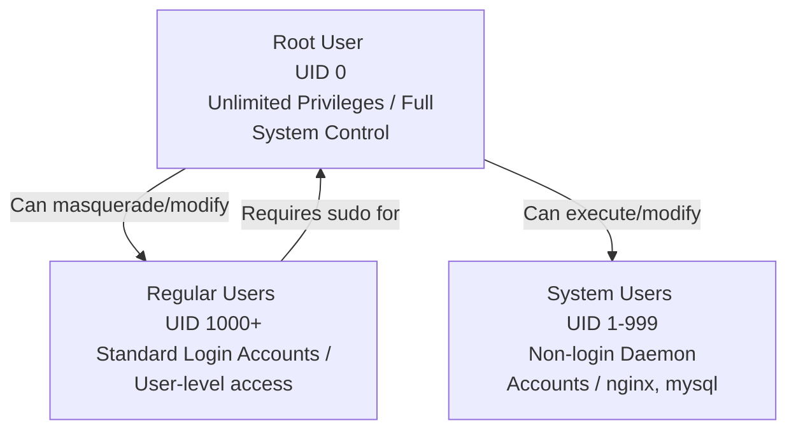
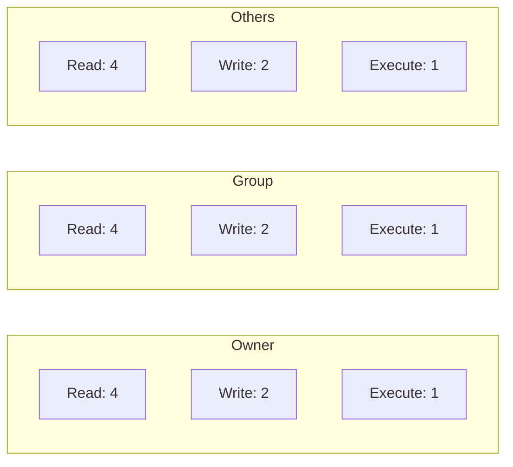

Every operating system needs to know who the fuck is logged in and what they are allowed to touch. In Linux, user management is the core of security. If you screw this up, you might give a random database daemon the rights to overwrite your entire root partition. Let's break down how Linux user accounts, groups, and permissions actually work, without the boring textbook fluff.


---

## 1. What is a User?

A user is simply an entity that can log into the system and run commands in a shell. Every user has a unique identifier called a UID (User ID). 

To check who you are currently logged in as, use the `whoami` command.

### User Types and Hierarchy

Linux divides users into three distinct categories:
1. **Root User (Superuser):** Has `UID = 0`. This is the absolute god of the system. Root bypasses all permission checks and can read, write, or delete anything, including the operating system itself.
2. **System Users:** Have `UIDs 1-999`. These are created automatically during software installations (like `nginx`, `mysql`, `systemd`). They don't have login shells because they exist solely to run background services with restricted permissions.
3. **Regular Users:** Have `UIDs 1000+`. These are real humans (like you, or `nirusaki`). They can log in, run commands, and perform operations in their home directory, but they cannot perform high-privilege system operations without using `sudo`.

### User Types Hierarchy



---

## 2. Managing Users: Jupyter Style (.ipynb)

Below is a structured notebook-like flow showing how to query your user identity, create new users, configure passwords, and verify database entries.

### Cell 1: Check Current User
```bash
%%bash
whoami
```
> **Expected Output:**
> ```text
> nirusaki
> ```

### Cell 2: Create a New User
```bash
%%bash
# Add a new user with a home directory
sudo useradd -m testuser
```
> **Expected Output:**
> *(No standard output. Creates home directory at /home/testuser)*

> [!WARNING]
> Always use the `-m` flag when running `useradd`. If you forget it, the system will not create a home folder for the new user. Without a home directory, the user is basically a homeless ghost in the filesystem: they won't have a place to save settings, create custom files, or even run standard configurations.

### Cell 3: Set User Password
```bash
%%bash
# Set a secure password for the new user
sudo passwd testuser
```
> **Expected Output:**
> ```text
> New password: 
> Retype new password: 
> passwd: password updated successfully
> ```

### Cell 4: View Configured Users
All users on a Linux system are listed inside `/etc/passwd`.
```bash
%%bash
# View the end of the user database file
tail -n 3 /etc/passwd
```
> **Expected Output:**
> ```text
> systemd-coredump:x:999:999:systemd Core Dumper:/:/usr/bin/nologin
> nirusaki:x:1000:1000:Nirusaki:/home/nirusaki:/bin/zsh
> testuser:x:1001:1001::/home/testuser:/bin/bash
> ```


---

## 3. Switching Users (su)

To switch your current active session to another user, use the `su` (substitute user) command:

`su - testuser`

The `-` flag is critical: it starts the shell as a login shell, loading the environment variables, paths, and configurations specific to that user.

To switch back to root (or standard user), just type:

`exit`

---

## 4. Understanding Groups

Assigning permissions to individual users one-by-one is a massive pain in the ass. Instead, Linux uses groups. A group is a collection of users. When you assign access permissions to a group, every user inside that group inherits those permissions.

### Types of Groups
1. **Primary Group:** Every user has exactly one primary group. When a user creates a new file, the file's group ownership is automatically set to that user's primary group. By default on most distributions, the primary group name is identical to the username (e.g., user `nirusaki` belongs to primary group `nirusaki`).
2. **Secondary (Supplementary) Groups:** A user can belong to multiple secondary groups. These are used to grant access to specific system resources, like `docker`, `wheel` (for sudo access), or `audio`.

### Managing Groups

### Cell 5: Create a Group and Add a User
```bash
%%bash
# Create a new group called devteam
sudo groupadd devteam

# Add testuser to the devteam secondary group
sudo usermod -aG devteam testuser
```
> **Expected Output:**
> *(No standard output. User added successfully.)*

### Cell 6: Verify User Groups
```bash
%%bash
# Print groups of testuser
groups testuser
```
> **Expected Output:**
> ```text
> testuser : testuser devteam
> ```


---

## 5. File Permissions

Run `ls -l` on any directory, and you will see a bunch of cryptic characters at the start of each line:

`-rwxr-xr-- 1 nirusaki devteam 4096 Jul 02 01:17 script.sh`

Let's dissect this block:
*   The very first character indicates the type: `-` represents a standard file, and `d` represents a directory.
*   The next 9 characters are split into three sets of three: **Owner (User)**, **Group**, and **Others**.

```text
 -   rwx   r-x   r--
 ▲    ▲     ▲     ▲
 │    │     │     └─ Others Permissions (Read only)
 │    │     └─────── Group Permissions (Read, Execute)
 │    └───────────── Owner/User Permissions (Read, Write, Execute)
 └────────────────── File Type (- = file, d = directory)
```

### Changing Ownership (chown)
To change the owner or group of a file, use:

`sudo chown testuser:devteam script.sh`

---

## 6. Changing Permissions (chmod)

Permissions are modified using the `chmod` command. The most professional and precise way is using numeric representation:
*   **Read (r):** Value = 4
*   **Write (w):** Value = 2
*   **Execute (x):** Value = 1

To calculate the permission number for a section, sum the values:
*   Read + Write + Execute = 4 + 2 + 1 = **7**
*   Read + Execute (No Write) = 4 + 0 + 1 = **5**
*   Read only = **4**



### Syntax and Examples

The syntax is: `chmod <OwnerNum><GroupNum><OthersNum> file`

*   **chmod 755 script.sh:** Owner has full access (7), Group can read/execute (5), Others can read/execute (5). This is standard for executable files.
*   **chmod 600 private.txt:** Owner can read/write (6), Group and Others have zero access (0). Perfect for SSH keys or config files with API passwords.


---

**TEAM SPACEX FROM NIT HAMIRPUR ISN'T HAPPY WITH THIS PARTICULAR POST LOL IF YKYK**


Sayonara Signing Off Baa Byee...
