Welcome to Day 1 of our networking labs series. Today, we are going to explore how to construct isolated hosts (PCs), layer 2 switches, and ethernet cables entirely within the Linux kernel using virtual interfaces and namespaces. 

---

### What is a Network Namespace?

A **Network Namespace** is a Linux kernel feature that virtualizes the network stack. It isolates routing tables, IP addresses, network interface devices, and firewall rules. 

Historically, this allows you to create isolated network sandboxes that physically behave like independent PCs connected to a network.

Here is the topology of the virtual network we will construct in this lab:

```mermaid
graph TD
    subgraph LAN ["Virtual LAN (192.168.1.0/24)"]
        sw1["sw1 (Bridge / Switch)"]
        
        subgraph pc1_ns ["pc1 (Namespace)"]
            eth0_pc1["eth0 (192.168.1.1)"]
        end

        subgraph pc2_ns ["pc2 (Namespace)"]
            eth0_pc2["eth0 (192.168.1.2)"]
        end
        
        veth1_cable["veth-pc1 <---> veth-pc1-br"]
        veth2_cable["veth-pc2 <---> veth-pc2-br"]
        
        eth0_pc1 --- veth1_cable --- sw1
        eth0_pc2 --- veth2_cable --- sw1
    end

    style LAN fill:#111122,stroke:#3b82f6,stroke-width:2px
    style sw1 fill:#1e293b,stroke:#f59e0b,stroke-width:2px
    style pc1_ns fill:#1e1b4b,stroke:#8b5cf6,stroke-width:1px
    style pc2_ns fill:#1e1b4b,stroke:#8b5cf6,stroke-width:1px
```



---

### 1. Creating Isolated PCs (Network Namespaces)

First, we create our virtual PCs. We will allocate a namespace named `pc1` and another named `pc2`.

```python
%%bash
sudo ip netns add pc1
sudo ip netns add pc2
```

*   `netns` refers to network namespace.
*   `add` instructs the `ip` utility to provision a new isolated namespace namespace.

To list all currently active namespaces on the host:

```python
%%bash
ip netns list
```

**Output:**
```text
pc2
pc1
```

---

### 2. Inspecting the Isolated Interfaces

We can execute commands inside a specific namespace using `ip netns exec <name>`. This launches binaries within the context of that isolated networking stack instead of the host's default stack.

Let's list the interfaces inside `pc1` using `ip link`:

```python
%%bash
sudo ip netns exec pc1 ip link show
```

**Output:**
```text
1: lo: <LOOPBACK> mtu 65536 qdisc noop state DOWN mode DEFAULT group default qlen 1000
    link/loopback 00:00:00:00:00:00 brd 00:00:00:00:00:00
```

By default, the namespace is completely isolated. It only has a loopback interface (`lo`) which is turned off (`DOWN`). You can think of `pc1` as an isolated machine with no physical network cards or network connection whatsoever.


---

### 3. Creating a Layer 2 Switch

A Linux **bridge device** acts as a virtual switch. It forwards ethernet frames between connected ports by learning MAC addresses, mimicking a physical hardware switch.

Let's create a switch named `sw1` and bring it up:

```python
%%bash
sudo ip link add sw1 type bridge
sudo ip link set sw1 up
```

Bringing the interface state to `UP` is equivalent to plugging the switch into a power outlet and turning it on so devices can connect.


---

### 4. Creating Virtual Ethernet Cables

To connect our PCs to the virtual switch, we create **Virtual Ethernet (veth) pairs**. A `veth` pair behaves like a physical RJ45 ethernet cable: packets entering one endpoint immediately emerge out of the peer endpoint.

Let's create a cable with one endpoint named `veth-pc1` and the other named `veth-pc1-br` (switch-side):

```python
%%bash
sudo ip link add veth-pc1 type veth peer name veth-pc1-br
```

*   `type veth` specifies that this link is a virtual ethernet pair.
*   `peer name <name>` links the opposite end of the pipe to the specified interface card name.


---

### 5. Connecting the Cable to PC1 and the Switch

Now we plug one end of the cable (`veth-pc1`) into our PC namespace `pc1`, and bind the opposite end (`veth-pc1-br`) to our bridge switch `sw1`:

```python
%%bash
# Plug veth-pc1 into pc1 (this becomes the PC's network interface card)
sudo ip link set veth-pc1 netns pc1

# Plug the other end into our switch sw1
sudo ip link set veth-pc1-br master sw1

# Enable the switch-side interface
sudo ip link set veth-pc1-br up
```

At this stage, the cable is connected, but the host end of the port needs to be brought online (`up`).

---

### 6. Naming and Configuring IP Addresses

Let's jump inside `pc1` and rename the newly attached raw interface `veth-pc1` to standard `eth0` to make it clean and readable:

```python
%%bash
sudo ip netns exec pc1 ip link set veth-pc1 name eth0
```

Now, let's assign an IP address to `eth0` inside `pc1` and bring the interface online:

```python
%%bash
# Add IP address to interface
sudo ip netns exec pc1 ip addr add 192.168.1.1/24 dev eth0

# Bring the interface up
sudo ip netns exec pc1 ip link set eth0 up
sudo ip netns exec pc1 ip link set lo up
```

*   `ip addr add` assigns a static IP to the interface.
*   `/24` indicates a classless (CIDR) subnet mask (`255.255.255.0`).
*   `dev eth0` indicates the target device port.

---

### 7. Configuring PC2

We follow the exact same procedure to link `pc2` to our switch `sw1`:

```python
%%bash
# Create cable for PC2
sudo ip link add veth-pc2 type veth peer name veth-pc2-br

# Plug cable into PC2 and the Switch
sudo ip link set veth-pc2 netns pc2
sudo ip link set veth-pc2-br master sw1

# Enable interfaces
sudo ip link set veth-pc2-br up
sudo ip netns exec pc2 ip link set veth-pc2 name eth0
sudo ip netns exec pc2 ip addr add 192.168.1.2/24 dev eth0
sudo ip netns exec pc2 ip link set eth0 up
sudo ip netns exec pc2 ip link set lo up
```

---

### 8. Verifying Connection

Both virtual PCs are now connected to the virtual switch on the same IP subnet. We can verify Layer 2/3 connectivity by running a ping from `pc1` to `pc2`:

```python
%%bash
sudo ip netns exec pc1 ping -c 3 192.168.1.2
```

**Output:**
```text
PING 192.168.1.2 (192.168.1.2) 56(84) bytes of data.
64 bytes from 192.168.1.2: icmp_seq=1 ttl=64 time=0.045 ms
64 bytes from 192.168.1.2: icmp_seq=2 ttl=64 time=0.038 ms
64 bytes from 192.168.1.2: icmp_seq=3 ttl=64 time=0.036 ms

--- 192.168.1.2 ping statistics ---
3 packets transmitted, 3 received, 0% packet loss, time 2043ms
rtt min/avg/max/mdev = 0.036/0.039/0.045/0.003 ms
```

It works! We have established an isolated local network (VLAN) on the host computer.


---

### Summary and Next Steps

In this lab, we successfully learned how to configure:
1.  **Isolated PC Nodes:** Network Namespaces (`pc1`, `pc2`)
2.  **Layer 2 Switches:** Linux Bridge Devices (`sw1`)
3.  **Ethernet Cables:** Virtual Ethernet Pairs (`veth`)

**Homework:** Write a Python or Bash script to automate this setup process. 

In the next lab (Day 2), we will explore how to configure a virtual **Router** to route packets between different subnets.

byee.. signing out
